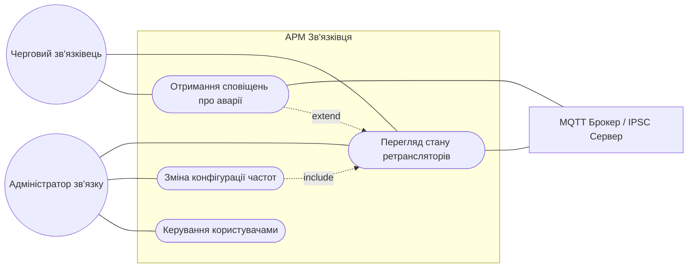
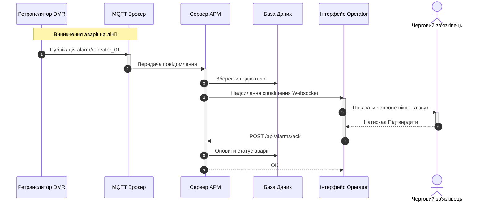

---

### 1. Текст для Use Case Diagram

<pre>

</pre>

---

### 2. Текст для Sequence Diagram

<pre>

</pre>

---

### 3. Текст для Activity Diagram

<pre>
```mermaid
graph TD
    Start((Початок)) --> Login[Авторизація Адміністратора]
    Login --> SelectRep[Вибір ретранслятора]
    SelectRep --> LoadConfig[Завантаження конфігурації]
    
    LoadConfig --> InputData{Введення нових частот}
    
    InputData -- Некоректні --> ShowError[Показати помилку]
    ShowError --> InputData
    
    InputData -- Валідні --> SaveConfig[Зберегти зміни локально]
    SaveConfig --> Confirm{Застосувати на обладнанні}
    
    Confirm -- Скасувати --> Close[Закрити вікно]
    Close --> End((Кінець))
    
    Confirm -- Застосувати --> GenerateCMD[Генерація команди]
    GenerateCMD --> SendMQTT[Відправка через MQTT Брокер]
    SendMQTT --> WaitResp[Очікування відповіді від заліза]
    
    WaitResp --> CheckResp{Результат тесту}
    
    CheckResp -- Успіх --> UpdateUI[Статус Зміни застосовано]
    UpdateUI --> LogEvent[Записати подію в аудит]
    LogEvent --> End
    
    CheckResp -- Помилка --> ShowFail[Помилка конфігурації]
    ShowFail --> LogEvent
